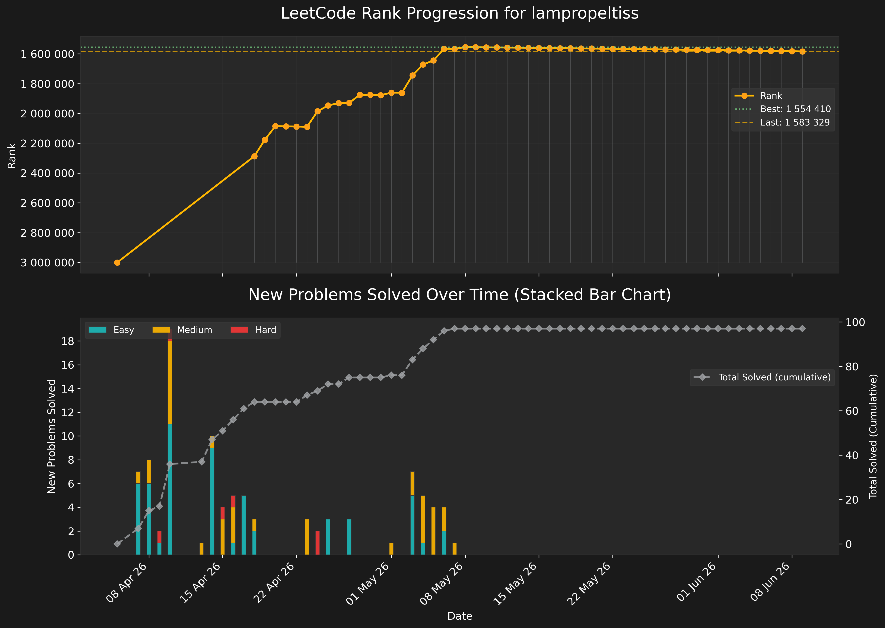

# 📊 LeetGraph — автоматический трекер прогресса на LeetCode


**Обзор проекта**: автоматическая система сбора, анализа и визуализации статистики пользователя LeetCode с ежедневным обновлением через GitHub Actions. Проект получает данные через GraphQL API LeetCode, сохраняет историю изменений в CSV, генерирует графики прогресса и текстовый отчет, автоматически коммитит обновления в репозиторий.

**Главный результат**: график прогресса.



## Особенности

- **Автоматический сбор данных** — ежедневное получение статистики через официальный GraphQL API LeetCode
- **История изменений** — сохранение всех данных в CSV с отслеживанием динамики
- **Визуализация прогресса**:
  - График изменения рейтинга (ранга) с отметкой лучшего результата
  - Столбчатая диаграмма решенных задач по сложности (Easy/Medium/Hard)
  - Линия cumulative total solved
- **Текстовые отчеты** — статистика за последние 14 дней с динамикой изменений
- **Темное оформление** — профессиональная темная тема для графиков
- **CI/CD интеграция** — ежедневный автоматический запуск через GitHub Actions


## 🛠️ Технологии и библиотеки

### Основные зависимости
- **pandas** — обработка и анализ данных, работа с CSV
- **matplotlib** — построение графиков и визуализация
- **requests** — HTTP-запросы к GraphQL API LeetCode


## 📈 Пример вывода

### Запуск
- **Расписание**: каждый день в 00:00 UTC
- **Вручную**: через интерфейс GitHub Actions

### Визуализация (leetcode_stat_graph.png)

- Два графика в одном окне
- Верхний: динамика рейтинга с отметкой лучшего результата
- Нижний: stacked bar chart новых задач + общий прогресс

### Текстовый отчет (stat_log.txt)
```
=======================================================
        📊 Прогресс за последние 14 дней
=======================================================
       date  rank_up  easy_new medium_new hard_new
 27 Mar (Fri)        2         1          -        -
 28 Mar (Sat)        0         -          -        -
 29 Mar (Sun)        5         2          1        -
...
=======================================================
```

## Как это работает

### 1. Сбор данных (data_parser.py)
- Отправляет GraphQL запрос к LeetCode API
- Получает: рейтинг, количество решенных задач по сложности
- Формирует словарь с текущей датой и статистикой

### 2. Хранение данных (data_saver.py)
- Если CSV не существует — создает с заголовками
- Проверяет последнюю запись по дате:
  - Дата новая → добавляет строку
  - Дата совпадает, но данные изменились → обновляет
  - Дата совпадает и данные те же → пропускает

### 3. Обработка данных (data_prepare.py)
- Заполняет пропуски методом forward fill
- Вычисляет новые задачи за день (diff)
- Подготавливает данные для графиков

### 4. Визуализация (graph_1.py, graph_2.py)
- **Верхний график**: изменение рейтинга, лучший результат, вертикальные линии
- **Нижний график**: stacked bar chart новых задач + линия общего прогресса

### 5. Отчетность (log_last_data.py)
- Генерирует таблицу за последние 14 дней
- Показывает: изменение рейтинга, новые задачи по сложности
- Сохраняет в текстовый файл

### 6. Автоматизация (GitHub Actions)
- Ежедневный запуск по расписанию (cron: `0 0 * * *`)
- Кэширование зависимостей pip
- Автоматический коммит и пуш изменений
